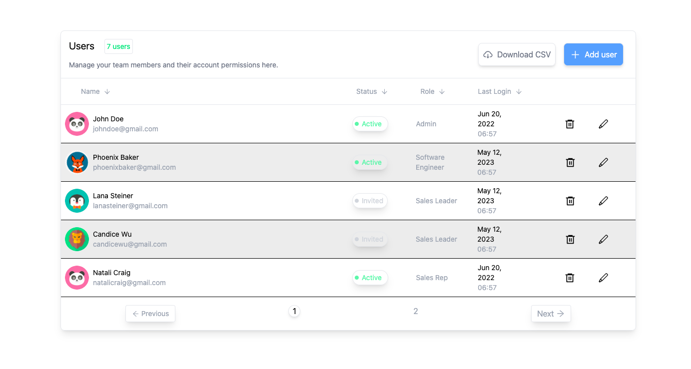
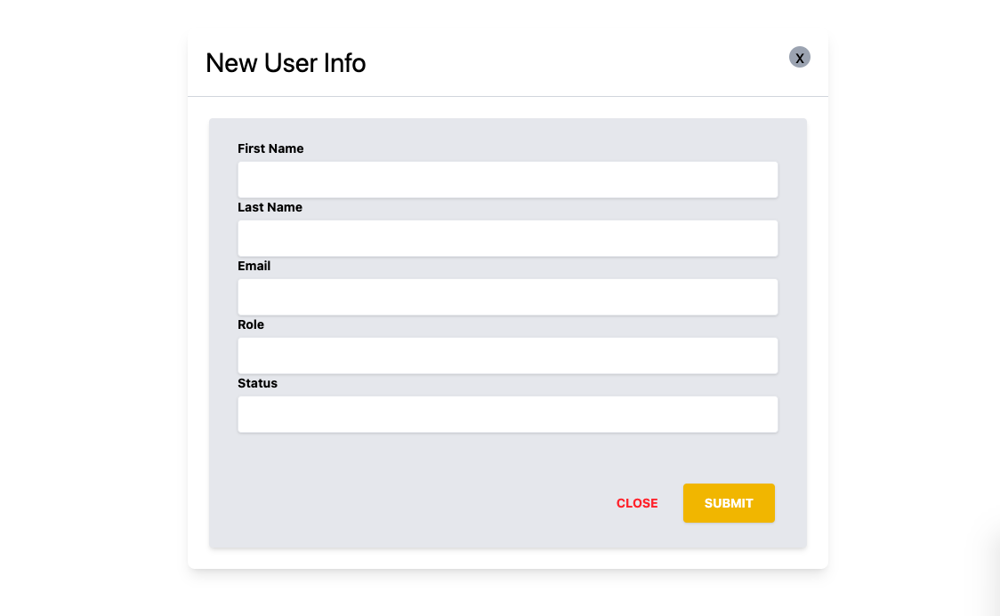

# Attendii

## About the project
* This project is a web app for storing details of employees with their status, role and all other required features.

## Setup up and Run locally
* Clone the project $git clone link
* install all required packages $npm i 
* run the project $npm run dev

## Features in the project
* Adding User to the database
* Downloading data in csv file
* Deleting user data
* Editing user data
* Pagination with five user per page
* Form to get information for adding new user

## Tech Used
* React js (front-end)
* Typescript
* json-server package, hosted on render(back-end)
* Tailwind (styling)
* Vite (dev server)
## Live Project
<a href="https://645ffa29f1d26409e1c5aa98--fanciful-semifreddo-1d1b6b.netlify.app/">
<button style="border-radius: 5px; background-color: #555; color: white; width: 100px; height: 40px; margin-bottom: 10px">LIVE</button>
</a>

